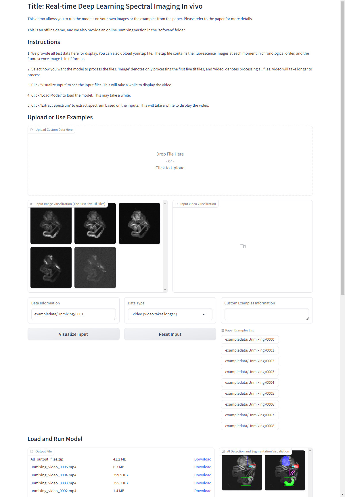

# EndmemberNet
Official Implementation for "Real-time Deep Learning Spectral Imaging In vivo".
## Offline Demo

We provide a offline demo for EndmemberNet at http://fdudml.cn:6789. You can also employ the following steps to run the demo locally.



1. Download the Finetuned Models

You can download the finetuned models  from the [Zenodo repository](https://doi.org/10.5281/zenodo.13622929) or [Hugging Face](https://huggingface.co/Orange066/Unmixing_Model) and the examples from the [Zenodo repository](https://doi.org/10.5281/zenodo.13622692)  or [Hugging Face](https://huggingface.co/datasets/Orange066/Unmixing_ExampleData) of EndmemberNet. Then, you can 'tar -xzvf' the file and put the folder in the root directory of EndmemberNet. The path should be structured as follows:

```
exampledata/
    Unmixing/

checkpoints/
    detection/
    segmentation/
```

2. Install Packages 

* We use Anaconda to create enviroment.

```
conda create -n unmixing python=3.9
conda activate unmixing
```

* Install Pytorch 2.0.1, CUDA 11.7 and CUDNN 

```
conda install pytorch==2.0.1 torchvision==0.15.2 torchaudio==2.0.2 pytorch-cuda=11.7 -c pytorch -c nvidia
```

* Install Python Packages: 

You can install the required python packages by the following command:

```
pip install ultralytics gitpython opencv-python lmdb imageio scikit-image tensorboard medpy numpy scipy tiffile matplotlib protobuf gradio==3.39.0 fastapi==0.111.0 fastapi-cli==0.0.4 gradio_client==0.16.1  httpx==0.24.1 nest-asyncio==1.5.8 uvicorn==0.30.1
```

3. Run the Web Interface

You can run the web interface by the following command:

```
python app.py
```

Then, you can visit the web interface at [http://127.0.0.1:7866/](http://127.0.0.1:7866/). You can upload your own image or use our examples to run EndmemberNet.

## Train and Test EndmemberNet

### 1. Prepare the datasets

You can download our preprocessed  training, validation, testing datas from the [Zenodo repository](https://doi.org/10.5281/zenodo.13622692) or [Hugging Face](https://huggingface.co/datasets/Orange066/Unmixing_TrainValTestData) and extract it into the `detection/` folder. The data path should be structured as follows:

```
detection/
    data/
    	hyps/
    	images/
    	scripts/
    	unmixing/
```

### 2. Train detection model

Run the following code to train and test the detection model:

```
cd detection # Get into the directory

CUDA_VISIBLE_DEVICES=0 python train.py --data data/unmixing/unmixing.yaml --name unmixing # Train the model

sed -i 's/\r//' test.sh && bash test.sh # Test the model
sed -i 's/\r//' test.sh && bash test.sh # Test the model using quick data augmentation
```

You can then find the trained detection model and the test dataset results in the `detection/runs/train/` and `detection/runs/detect/` folders, respectively.

### 3. Train segmentation model

Run the following code to train and test the segmentation model:

```
cd segmentation # Get into the directory

CUDA_VISIBLE_DEVICES=0 python train.py # Train the model

CUDA_VISIBLE_DEVICES=0 python test.py # Test the model
CUDA_VISIBLE_DEVICES=0 python test_quick.py # Test the model using quick data augmentation detection results
```

You can then find the trained segmentation model and the test dataset results in the ` segmentation/train_log/` and `metric/` folders, respectively.

### 4. Unmixing

Run the following code to generate the unmixing results in the `unmix/` folder:

```
python unmix.py # unmixing.py file is in the root path
```

### 5. Demo

Copy `detection/runs/train/unmixing/weights/best.pt` to `checkpoints/detection/`, and copy `segmentation/train_log/checkpoints/detection/multimodal.pkl` to `checkpoints/segmentation/`.  Then, download the examples from the [Zenodo repository](https://doi.org/10.5281/zenodo.13622692)  or [Hugging Face](https://huggingface.co/datasets/Orange066/Unmixing_ExampleData) of EndmemberNet, and 'tar -xzvf' the file and put the folder in the root directory of EndmemberNet. The path should be structured as follows:

```
exampledata/
    Unmixing/

checkpoints/
    detection/
    segmentation/
```

After that, run the following command:

```
python demo.py
```

Then, you can visit the web interface at [http://127.0.0.1:7866/](http://127.0.0.1:7866/). You can upload your own image or use our examples to run EndmemberNet.

### 6. Software

We provide the software in the 'software' directory. Please download the finetuned models  from the [Zenodo repository](https://doi.org/10.5281/zenodo.13622929) or [Hugging Face](https://huggingface.co/Orange066/Unmixing_Model) and the examples from the [Zenodo repository](https://doi.org/10.5281/zenodo.13622692)  or [Hugging Face](https://huggingface.co/datasets/Orange066/Unmixing_ExampleData) of EndmemberNet. Then, you can 'tar -xzvf' the file and put the folder in the root directory of EndmemberNet. 

```
camera/
    exampledata/
        Unmixing/
    checkpoints/
        detection/
        segmentation/
        
example/ 
    exampledata/
        Unmixing/
    checkpoints/
        detection/
        segmentation/
```

In the 'software/camera' folder, you can use a Princeton camera to capture fluorescence images and perform real-time unmixing, provided you **install the LightField software and set the 'LIGHTFIELD_ROOT' environment variable**. If the 'LIGHTFIELD_ROOT' path is not set, you can run the 'main.exe' file in the 'software/example' folder and click 'Use Example' and 'Extract Spectrum' to view the example unmixing results from our paper.

## Credit

Our code borrows from [YOLOv5](https://github.com/ultralytics/yolov5), [Deeplabv3+](https://github.com/VainF/DeepLabV3Plus-Pytorch), and [RIFE](https://github.com/hzwer/ECCV2022-RIFE)