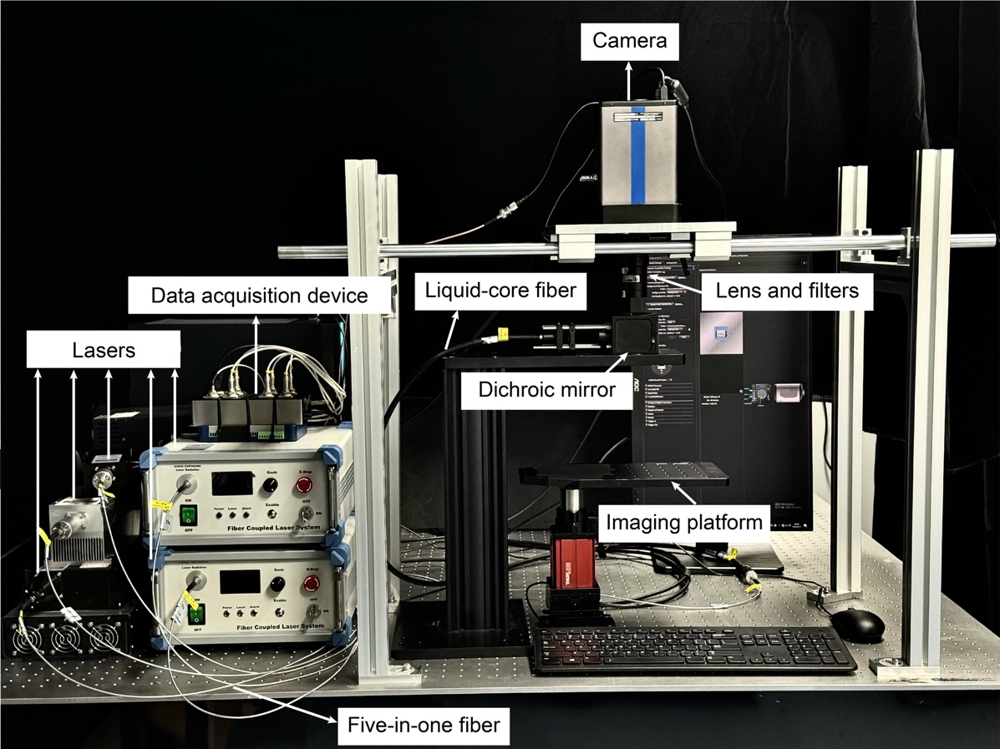
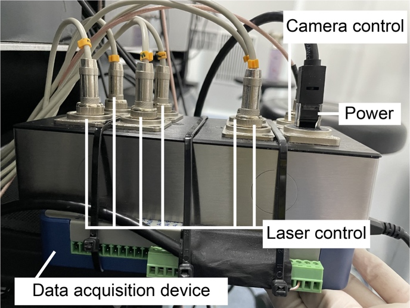
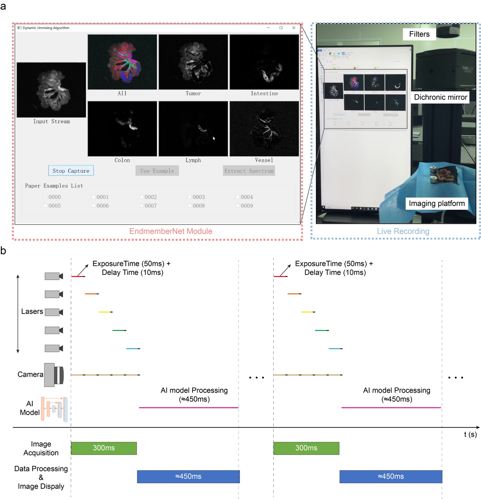

# Imaging Tutorial

This section provides the steps for excitation-encoded shortwave infrared (SWIR) multispectral imaging using a custom-built wide-field dynamic imaging system. The system enables real-time acquisition and unmixing of multispectral data via integration with the EndmemberNet neural network.

------

## General Settings

Five-color multispectral imaging with Lanbow fluorophores was performed using a custom-built wide-field dynamic imaging system. The system employs sequential laser excitation at five wavelengths (671, 690, 730, 760, and 785 nm) and frame-synchronized detection with an InGaAs camera (NIRvana 640, 640 × 512 pixels; Princeton Instruments).

------

## 1. Preparation for Excitation Module

- **Laser Configuration**:
   Five continuous-wave semiconductor lasers (671, 690, 730, 760, and 785 nm) were combined using a five-in-one metal-cladded multimode fiber (200 μm input, 400 μm output) and homogenized using a liquid-core fiber.
- **Laser Power Density**:
  - 671, 690, 730, 760 nm: 100 mW cm⁻²
  - 785 nm: 125 mW cm⁻²
- **Synchronization**:
   A Data Acquisition (DAQ) device generates TTL signals for synchronized operation between laser drivers and the InGaAs camera.

------

## 2. Preparation for Imaging Parameters

The imaging system is controlled via **LightField® software**. A custom plugin enables synchronized triggering of the camera and laser pulses.

**Key configuration parameters:**

| Parameter                           | Value                               |
| ----------------------------------- | ----------------------------------- |
| Exposure time per channel           | 50 ms                               |
| Laser illumination time per channel | 50 ms                               |
| Delay time                          | 10 ms                               |
| A/D Conversion Rate                 | 25 MHz                              |
| Trigger-in Mode                     | Expose during trigger (rising edge) |
| Camera Cooling                      | -50 °C                              |

------

## 3. Preparation for Real-Time Imaging

- **Animal Setup**:
  - Mice were anesthetized and placed on a heating pad. The abdominal cavity was opened to expose the intestinal tract. Focus was adjusted under bright-field mode.

- **Image Acquisition:**
  - Laser excitation was initiated.
  - Real-time imaging software was launched.

- **Integration with EndmemberNet**:
  - Real-time processing is achieved by integrating the EndmemberNet deep learning model.
  - Software captures images, applies spectral unmixing, and displays results on the fly.

> For code and additional instructions, see [EndmemberNet GitHub](https://github.com/Orange066/EndmemberNet/tree/main)

------

## 4. Real-Time Workflow

### a. Image Acquisition

- Sequential triggering of five lasers
- Synchronized capture of five corresponding frames
- Duration: ~300 ms

### b. Data Processing & Display

- Images are stacked into a 3D batch (x, y, λ)
- Passed to EndmemberNet for:
  - Pure spectral region identification
  - Linear unmixing
  - Visualization and saving
- Processing Time: ~450 ms (using Nvidia RTX 3060 GPU)

### Automated Execution

By clicking **“Camera Capture”**, the following steps occur:

- Launch LightField® with pre-saved settings
- Acquire a multispectral batch (5 frames)
- Process batch with EndmemberNet
- Visualize and save raw, unmixed, and merged outputs