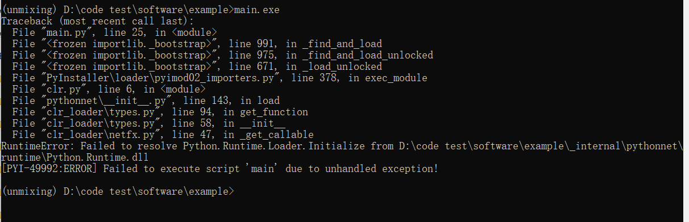

# Software
Please download the finetuned models  from the [Zenodo repository](https://doi.org/10.5281/zenodo.13622929) or [Hugging Face](https://huggingface.co/Orange066/Unmixing_Model) , the examples from the [Zenodo repository](https://doi.org/10.5281/zenodo.13622692) or [Hugging Face](https://huggingface.co/datasets/Orange066/Unmixing_ExampleData) of EndmemberNet and software from the [Zenodo repository](https://doi.org/10.5281/zenodo.13622929) or [Hugging Face](https://huggingface.co/Orange066/Unmixing_Model). Then, you can unzip the file and put the folder in the root directory of EndmemberNet.

```
camera/
    main/
        exampledata/
            Unmixing/
        checkpoints/
            detection/
            segmentation/
        lib/
        main.exe
        
example/ 
    main/
        exampledata/
            Unmixing/
        checkpoints/
            detection/
            segmentation/
        lib/
        main.exe
```

In the `software/camera` folder, you can use a Princeton camera to capture fluorescence images and perform real-time unmixing, provided you **install the LightField software and set the `LIGHTFIELD_ROOT` environment variable**.  

If the `LIGHTFIELD_ROOT` path is not set, you can run the `main.exe` file in the `software/example` folder and click **Use Example** and **Extract Spectrum** to view the example unmixing results from our paper.

> ⚠️ Our software supports GPU acceleration using an **NVIDIA 2080Ti** and **CUDA 11.8**.  
> In other environments where GPU support may be unavailable, it will fall back to CPU processing, which may result in slower performance.


## Trouble Shooting
### Resolving `RuntimeError: Failed to resolve Python.Runtime.Loader.Initialize`

If your application crashes and running `main.exe` via Command Prompt results in the error:

```
RuntimeError: Failed to resolve Python.Runtime.Loader.Initialize
```



you can try unblocking `Python.Runtime.dll`:

1. Navigate to the directory containing `Python.Runtime.dll`.
2. Right-click on `Python.Runtime.dll` and select **Properties**.
3. In the **General** tab, if there's an **Unblock** checkbox, check it.
4. Click **OK** to apply the changes.

This issue often occurs when the `.dll` file is blocked by Windows after being copied from another system or downloaded. Unblocking it allows the application to access the necessary runtime components.